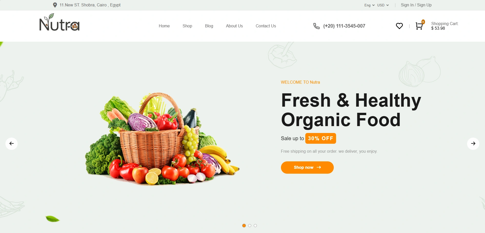
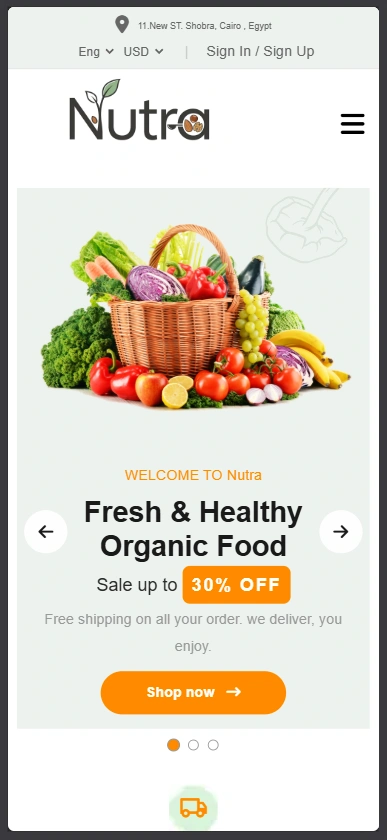

# Nutra 🌿

An e-commerce web app for organic food products, built with React. No UI library. State managed with Context API + useReducer. Full responsive design from 320px to 1800px+.


---

## Live Demo

---

## Screenshots




---

## Features

### Shopping

- Browse products fetched from [DummyJSON API](https://dummyjson.com/products/category/groceries)
- Filter by category, price range, and star rating
- Sort products by latest or oldest
- Product detail page with image gallery, reviews, and add-to-cart

### Cart & Checkout

- Add, remove, increment, decrement cart items
- Cart sidebar popup with live item count and total
- Full checkout form with validation (first name, last name, address, email, phone, zip code)
- Order confirmation modal on success, error message on incomplete fields
- Cart clears automatically after successful order

### Favorites

- Toggle any product as favorite
- Dedicated favorites page with add-to-cart from wishlist

### UI & Navigation

- Responsive navbar: full links on desktop, burger menu on mobile
- Animated carousel banner with auto-play (6s interval), manual prev/next arrows, and dot indicators
- Text stays fixed while images transition
- Breadcrumb trail on inner pages
- Subscribe popup with "don't show again" checkbox (persisted to localStorage)
- Toast notifications for cart and favorites actions
- Scroll-to-top button
- Countdown timer (persisted across sessions)

### Data Persistence

- Cart and favorites survive page refresh via localStorage
- Timer state synced to localStorage

---

## Tech Stack

| Layer     | Technology                                |
| --------- | ----------------------------------------- |
| Framework | React 19                                  |
| Routing   | React Router DOM v7                       |
| State     | Context API + useReducer                  |
| Styling   | Pure CSS (custom variables, no framework) |
| Build     | Vite 8                                    |
| Icons     | RemixIcon, Font Awesome                   |
| Data      | DummyJSON REST API                        |

---

## Project Structure

```
src/
├── components/
│   ├── CartPopup/          # Slide-in cart sidebar
│   ├── Footer/             # Footer with social links and download section
│   ├── Navbar/             # Navbar + SearchBar
│   ├── ProductCard/        # Reusable product card with cart/fav actions
│   ├── StarRating/         # Star rating display component
│   ├── SubscribePopup/     # Newsletter popup
│   └── SuccessToast/       # Toast notifications
│
├── context/
│   ├── store.js            # Global state: cart, favorites, products, filters
│   ├── StoreContext.jsx    # StoreProvider with localStorage sync
│   ├── toast.js            # Toast context
│   └── ToastContext.jsx    # ToastProvider with auto-dismiss
│
├── hooks/
│   ├── useProducts.js      # Fetches products on mount, dispatches to store
│   └── useTimer.js         # Countdown timer with localStorage persistence
│
├── layouts/
│   └── MainLayout.jsx      # Wraps all pages with Navbar, Footer, popups
│
├── pages/
│   ├── HomePage.jsx        # Landing page: banner, categories, products, blog
│   ├── ProductsPage.jsx    # All products with sidebar filters
│   ├── ProductInfoPage.jsx # Single product detail
│   ├── ShoppingCartPage.jsx
│   ├── CheckoutPage.jsx
│   ├── FavoritesPage.jsx
│   ├── BlogPage.jsx
│   ├── AboutUsPage.jsx
│   └── ContactPage.jsx
│
├── styles/
│   ├── style.css           # Main styles + responsive breakpoints
│   ├── products.css        # Products page and filter sidebar styles
│   ├── checkout.css        # Checkout form and order summary
│   ├── shoppingCart.css    # Cart page
│   ├── favorites.css       # Favorites page
│   ├── productInfo.css     # Product detail page
│   ├── contact.css         # Contact page
│   └── aboutUs.css         # About page
│
└── utils/
    ├── localStorage.js     # getFromStorage / saveToStorage helpers
    └── priceUtils.js       # getDiscountedPrice, formatPrice, cart totals
```

---

## State Management

Global state lives in a single reducer. No Redux, no Zustand.

```js
// Actions
FETCH_PRODUCTS_START;
FETCH_PRODUCTS_SUCCESS;
FETCH_PRODUCTS_ERROR;
ADD_TO_CART;
INCREMENT_QUANTITY;
DECREMENT_QUANTITY;
REMOVE_FROM_CART;
TOGGLE_FAVORITE;
SET_SEARCH_TERM;
SET_CATEGORY;
SET_PRICE_RANGE;
SET_RATING_FILTER;
```

Cart and favorites are saved to localStorage on every change via `useEffect` in `StoreProvider`.

---

## Responsive Breakpoints

| Breakpoint        | Behavior                                   |
| ----------------- | ------------------------------------------ |
| `> 1700px`        | Full layout, large banner text             |
| `1080px – 1700px` | Reduced banner padding, smaller title font |
| `< 1080px`        | Stacked banner, burger menu, mobile nav    |
| `< 768px`         | Single column layouts, compact cards       |
| `< 576px`         | Grid-based cart and favorites items        |

---

## Getting Started

**Prerequisites:** Node.js 20+

```bash
# Clone
git clone https://github.com/your-username/nutra.git
cd nutra

# Install
npm install

# Run dev server
npm run dev

# Build for production
npm run build

# Preview production build
npm run preview
```

---

## API

Products are fetched from the free [DummyJSON API](https://dummyjson.com).

```
GET https://dummyjson.com/products/category/groceries
```

Returns 30 grocery products with title, price, discountPercentage, rating, stock, images, and tags.

---

## Known Limitations

- No backend. Orders are not actually processed.
- No authentication. Cart and favorites are stored locally per browser.
- Product data is limited to the groceries category from DummyJSON.
- Blog posts are static mock data.

---

## Roadmap

- [ ] TypeScript migration
- [ ] Add search results page
- [ ] Real backend with order history
- [ ] Dark mode toggle
- [ ] Unit tests with Vitest

---

## Author

**Abdul Rahman Rafat**
Frontend Developer — ITI Graduate (160+ hours)

[](https://www.linkedin.com/in/abdul-rahman-rafat-b571a4361/)
[](https://github.com/your-username)

---

## License

MIT
